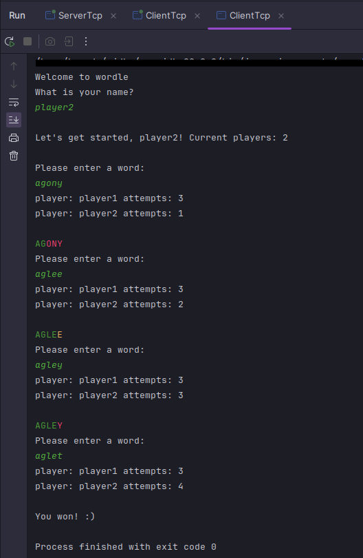

# Juego de Wordle Multijugador 

Este proyecto implementa un juego Wordle multijugador en Java utilizando la conexión TCP. La estructura del proyecto se organiza en el paquete `net`, que contiene tres clases principales: `ClientTcp`, `ServerTcp`, y `ThreadTcp`.

## Estructura del Proyecto
### Paquete `net`

#### Clase `ClientTcp`
**Modelo:**
- Board: Representa el estado del juego.
- Move: Contiene la información de la jugada del jugador.
- Logic: Gestiona la lógica del juego.

**Descripción:**
- El cliente se conecta al servidor y participa en el juego Wordle.
- Controla la entrada y salida de datos con el servidor.
- Gestiona el ciclo del juego y la interacción con el usuario.

#### Clase `ServerTcp`
**Modelo:**
- Board: Representa el estado del juego.
- Logic: Gestiona la lógica del juego.

**Descripción:**
- El servidor acepta conexiones de clientes y coordina el juego Wordle.
- Administra la lógica del juego y el estado del tablero para múltiples jugadores.

#### Clase `ThreadTcp`
**Modelo:**
- Board: Representa el estado del juego.
- Move: Contiene la información de la jugada del jugador.
- Logic: Gestiona la lógica del juego.

**Descripción:**
- Un hilo dedicado a cada conexión cliente-servidor.
- Maneja la comunicación y la lógica del juego para un jugador específico.

## Cómo Jugar
1. Ejecuta la clase `ServerTcp` para iniciar el servidor.
2. Ejecuta varias instancias de la clase `ClientTcp`, ingresando un nombre único para cada jugador.
3. Adivina la palabra oculta ingresando palabras cuando se te solicite.
4. El juego continuará hasta que un jugador adivine correctamente la palabra o todos los jugadores agoten sus intentos.

 
